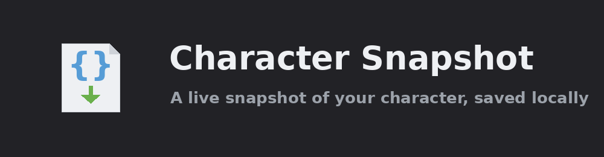

  

<h1 align="center">Character Snapshot</h1>

Character Snapshot saves a live snapshot of your current character — your stats right now, where you
are, and what you're doing — to a plain JSON file on your own computer, refreshed as you play. Any
local tool you like can read that file: a spreadsheet, a script, a personal dashboard, or a local
assistant. The plugin makes **no network calls of any kind** — nothing leaves your machine.

## Features

### A live snapshot, not a log

- **Your character, right now.** Boosted stats, current hitpoints / prayer / run energy, your world
  location, active Grand Exchange offers, and your current slayer task — always the latest values,
  not a growing history file.

- **One file per character.** Each account writes its own `<name>.json`, so snapshots never mix.

### Local and private

- **Never over the network.** The plugin only writes a local file — no HTTP client, no socket,
  nothing uploaded.

- **Safe to read at any time.** Each save is written to a temporary file and renamed into place, so a
  program reading the file never catches a half-written document.

### Everything it captures

- **Live state.** Boosted skill levels, vitals (hitpoints, prayer, run energy), world location, and
  active Grand Exchange offers.

- **Character and account.** Name, combat level, world, account type (ironman and friends), and
  members status.

- **Items.** Bank contents (captured when you open the bank), inventory, and worn equipment.

- **Progress.** Skill levels and experience, quests and total quest points, achievement-diary
  completion, combat-achievement tiers, and slayer points and streak.

### Yours to tune

- **Toggle every category** so you export only what you want.

- **Your interval, your folder.** Choose how often the file is saved and, if you like, a custom folder
  to save it into.

The exported JSON is a documented, versioned contract — see [`SCHEMA.md`](SCHEMA.md) for every field.

## Links

- [Report a bug](https://github.com/Oveduumnakal/runelite-character-snapshot/issues/new?template=bug_report.yml)
- [Request a feature](https://github.com/Oveduumnakal/runelite-character-snapshot/issues/new?template=feature_request.yml)
- [Buy me a coffee](https://buymeacoffee.com/oveduumnakal)
